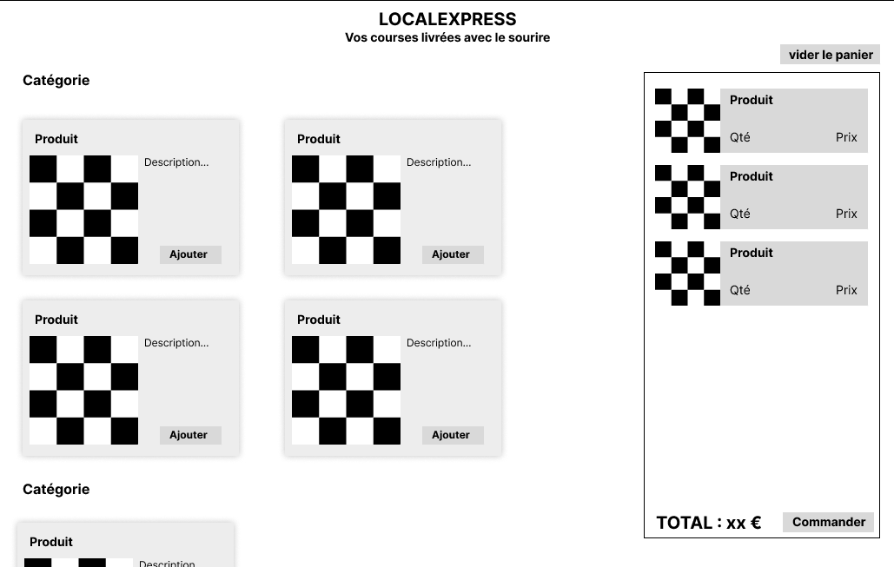

# Cahier des charges

**Société**  localexpress

**Objectif** faire de la livraison de courses à domicile

## Description 

Nous voulons une application web qui permet de commander des produits et de se faire livrer à domicile. Nous ne vendons que quelques produits, qui changent chaque semaine. Il n'est pas nécessaire d'avoir d'historique de commande.

Pour nous démarquer, nous souhaitons :

- Une interface simple, sans navigation. Les produits sont tous sur la même page, simplement rangés par catégories (a-z).
- Compatible smartphone
- Nous privilégions le contact humain
    * paiement à la livraison
    * facture papier (non gérée par l'application)
    * le livreur fera du teasing sur les produits à venir

Nous n'avons pas de contrainte sur la technologie utilisée. Il nous faudra juste un back-office pour gérer les produits et voir les commandes.

## Fonctionnalités du Projet

**Spécifications Fonctionnelles** :

1. Visualiser la liste des produits.

> Un invité peut consulter la liste des produits via la page d'accueil.
  
2. Consulter un produit avec une vue détaillée. 
 
> Un invité peut obtenir des informations complémentaires sur un produit en naviguant sur sa page dédiée.

3. Ajouter moduifier supprimer au panier

> - Un invité peut gerer son panier

4. Commander des produits

> - Un use connecté peut bvalider son panier

**Évolutions Potentielles** : aucune évolution potentielle recensée à ce jour ; pas même l'ajout d'un back-office.  

## Interface

Voici une idée de l'interface que nous imaginons. Nous ne sommes pas designers, donc n'hésitez pas à nous proposer des améliorations, car nous aimons vos réalisations.

Page d'acceuil :

image::./assets/w1.png[interface]

Page de sélection des produits :

Détail d'un produit :

image::./assets/w3.png[interface]

Finalisation d'une commande :

image::./assets/w4.png[interface]

Commande validée :

image::./assets/w5.png[interface]

## Maquettes et zonage

TODO

## Conception

### User stories

TODO

### Cas d’utilisation

TODO

### Diagramme d’entité-association

TODO

### Diagramme de séquence

TODO

### Diagramme d’activité

TODO

### Diagramme de déploiement

TODO

### Schéma d'architecture

TODO
